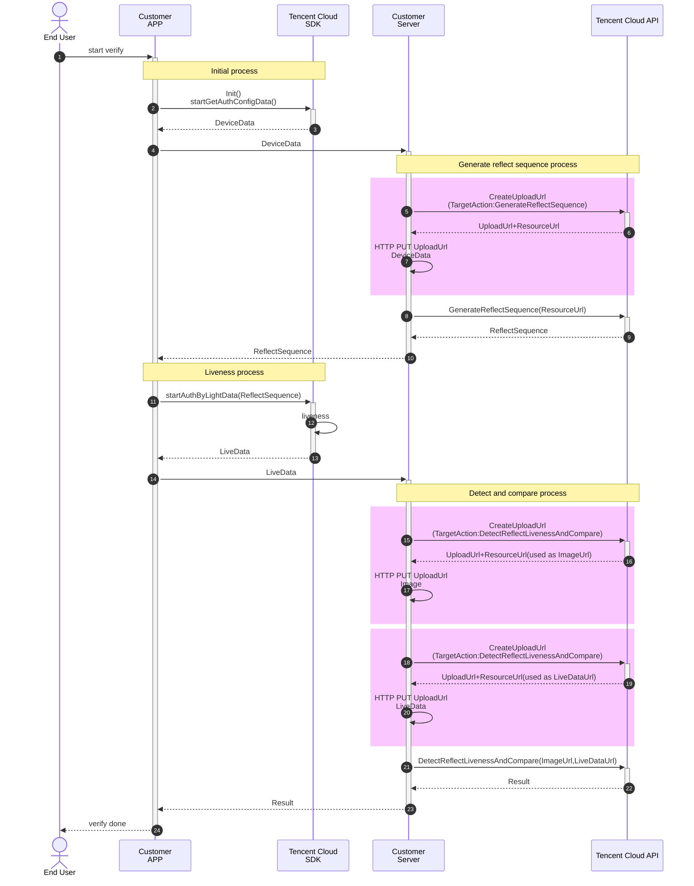

## Integration Preparations
- Sign up for a Tencent Cloud account. For more information, see [Signing Up](https://www.tencentcloud.com/document/product/378/17985).
- Complete enterprise identity verification. For more information, see [Enterprise Identity Verification Guide](https://www.tencentcloud.com/document/product/378/10496).
- Log in to the [FaceID console](https://console.intl.cloud.tencent.com/faceid) and activate the service. 
- [Contact us](https://www.tencentcloud.com/document/product/1061/52144) to obtain the latest SDK and license.


## Terms and Definitions

- Customer APP: An app developed by a customer.
- Customer Server: The business backend of a customer.
- Tencent Cloud API: The backend APIs provided by Tencent Cloud and used to obtain the face recognition credentials and the results.
- SDK: The SDK provided by Tencent Cloud for Android or iOS, which is to be integrated into the customer apps and to start the face recognition together with backend APIs.

## Sequence Diagram (Detailed)

In practice, we recommend that customers upload data resources by using the `CreateUploadUrl` API. The process is shown in the highlighted area in the following figure. Customers can also upload resources to their servers by other means. For more information, see [Passing Resources](https://intl.cloud.tencent.com/document/product/1061/46849).


Backend APIs: [GenerateReflectSequence](https://intl.cloud.tencent.com/document/product/1061/47646), [DetectReflectLivenessAndCompare](https://intl.cloud.tencent.com/document/product/1061/44246), [CreateUploadUrl](https://www.tencentcloud.com/document/product/1061/47648)

## Integration Steps

### 1. Customer app: Initializing the SDK and obtaining authentication information (Initial process in the sequence diagram)
Before using the FaceID SDK, you need to call this method to pass in basic configuration parameters and use the callback to pull the local configuration parameter information.

Sample code for Android:

```java
// HuiYanOs parameters.
HuiYanOsConfig huiYanOsConfig = new HuiYanOsConfig();
// The license file is placed in “assets”.
huiYanOsConfig.setAuthLicense("YTFaceSDK.license");
// Pull the local configuration parameter information before starting identity verification.
HuiYanOsApi.startGetAuthConfigData(huiYanOsConfig, new HuiYanConfigCallback() {
		@Override
		public void onSuccess(String result) {
			// The configuration information is obtained successfully and sent to the server to get the verification start configuration, and the server delivers the reflect sequence (implemented by yourself via step 4 as shown in the figure above).
			String reflectSequence = getAuthLightData(result);
      // ... Subsequent steps.
		}

		@Override
		public void onFail(int errorCode, String errMsg) {
			// Failed to get configuration parameters (implemented by yourself).
			showError(errorCode, errMsg);
		}
});
```

Sample code for iOS:

```objective-c
// HuiYanOs parameters.
HuiYanOsConfig *config = [[HuiYanOsConfig alloc] init];
// The path of the license file in the bundle.
config.authLicense = [[NSBundle mainBundle] pathForResource:@"YTFaceSDK.license" ofType:@""];
// The timeout period of local liveness detection in ms.
config.authTimeOutMs = 20000;
// Specify the language directory file in HuiYanSDKUI.bundle.
config.setLanguageFileName = @"th";// th.lproj
// Pull the local configuration parameter information before starting identity verification.
[HuiYanOsApi startGetAuthConfigData:config withSuccCallback:^(NSString * _Nonnull result) {
  	// The configuration information is obtained successfully and sent to the server to get the verification start configuration, and the server delivers the reflect sequence (implemented by yourself via step 4 as shown in the figure above).
  	NSString *liveData = [self getLiveDataWith:result];
} withFialCallback:^(int errCode, NSString * _Nonnull errMsg) {
  	// Failed to get configuration parameters (implemented by yourself).
    NSLog(@"errCode:%d, errMsg:%@", errCode, errMsg);
}];
```

The `startGetAuthConfigData` method of this SDK requires you to pass in a callback function to **receive DeviceData and upload it to Tencent Cloud through the customer server**. Sample DeviceData obtained:

```json
{
    "platform": 2,
    "select_data": "{\"change_point_num\":2,\"android_data\":{\"build_device\":\"flame\",\"build_display\":\"TP1A.220624.014\",\"build_product\":\"flame\",\"build_brand\":\"google\",\"build_model\":\"Pixel 4\",\"android_apilevel\":\"33\",\"build_hardware\":\"flame\",\"android_version\":\"13\",\"lux\":-10000},\"client_version\":\"sdk_version:1.1.20.221.1;ftrack_sdk_version:v3.0.5-mini.12;freflect_sdk_version:3.6.9.2;faction_sdk_version:3.7.5\",\"protocal\":1,\"config\":\"need_action_video\u003dtrue\u0026sdcs\u003d00031.1.20.221.101a634e43d16fe194c41712bf91c56076dd319a0fdcfd575a49d788ec950740ae54f38f04ae\",\"version\":\"3.6.9.2\",\"platform\":2,\"reflect_param\":\" version 2\"}"
}
```

**Note: Do not call Tencent Cloud APIs directly from the customer app.**

### 2. Customer server: Uploading DeviceData to generate a reflect sequence (Generate reflect sequence process in the sequence diagram)

#### 2.1 Uploading resources by calling the [CreateUploadUrl](https://www.tencentcloud.com/document/product/1061/47648) API
**Note 1: This step describes a general method for uploading resources, which is applicable to resource upload operations in subsequent steps.**
**Note 2: The region in the request for COS resources must be consistent with the region for the API call below. Otherwise, the call will fail.**

This API is used to obtain the following two URLs: `UploadUrl` to which resources are uploaded and `ResourceUrl` from which resources are obtained.

Input parameters:
- TargetAction: The target API that will use COS resources.

Output parameters:
- UploadUrl: The URL to which the resources are uploaded by the HTTP PUT method.
- ResourceUrl: The URL from which the uploaded COS resources can be obtained.
- ExpiredTimestamp: The timestamp when `UploadUrl` and `ResourceUrl` expire.
- RequestId: The ID of the current request.

Sample code for calling the SDK in Python:

```py
from tencentcloud.common import credential
from tencentcloud.common.exception.tencent_cloud_sdk_exception import TencentCloudSDKException
from tencentcloud.faceid.v20180301 import faceid_client, models

# You need to modify only secretId and secretKey, which you obtained when activating the service.
secretId = ""
secretKey = ""

try:
    cred = credential.Credential(secretId, secretKey)
    # Note that the request region must meet the requirements in the API documentation.
    client = faceid_client.FaceidClient(cred, "ap-hongkong")

    req = models.CreateUploadUrlRequest()
    # Input parameters.
    # TargetAction: Target API that will use the COS resources. The value is a string.
    req.TargetAction = "GenerateReflectSequence"
    
    resp = client.CreateUploadUrl(req)
    print(resp.to_json_string())

except TencentCloudSDKException as err:
    print(err)
```

Returned result:

```json
{
    "UploadUrl": "https://faceid-resource-hk-1258344699.cos.ap-hongkong.myqcloud.com/faceid%2FGenerateReflectSequence%2F1300847512%2F66f265e1-6d93-489e-9b34-8e75d8f6ecd8?q-sign-algorithm=sha1&q-ak=AKIDkJcgTzFEwNXR4SZP0KNAhxwf8KFsEJ7e&q-sign-time=1676537007%3B1676544207&q-key-time=1676537007%3B1676544207&q-header-list=host&q-url-param-list=&q-signature=2ae43986ba2feb0d04dde37ac7b140d8f9596fa7",
    "ResourceUrl": "https://faceid-resource-hk-1258344699.cos.ap-hongkong.myqcloud.com/faceid%2FGenerateReflectSequence%2F1300847512%2F66f265e1-6d93-489e-9b34-8e75d8f6ecd8?q-sign-algorithm=sha1&q-ak=AKIDkJcgTzFEwNXR4SZP0KNAhxwf8KFsEJ7e&q-sign-time=1676537007%3B1676544207&q-key-time=1676537007%3B1676544207&q-header-list=host&q-url-param-list=&q-signature=9a689732863cef49671d265b39e9aba8fa8f6947",
    "ExpiredTimestamp": 1676544207,
    "RequestId": "66f265e1-6d93-489e-9b34-8e75d8f6ecd8"
}
```

Now, you need to encode DeviceData generated in the first step **into the Base64 format** and upload it to `UploadUrl` by using the HTTP PUT method.

Sample code for Python:

```py
import requests
import base64
import json

# Set `upload_url` to the value of `UploadUrl` returned by the `CreateUploadUrl` API.
upload_url = "https://faceid-resource-hk-1258344699.cos.ap-hongkong.myqcloud.com/faceid%2FGenerateReflectSequence%2F1300847512%2F66f265e1-6d93-489e-9b34-8e75d8f6ecd8?q-sign-algorithm=sha1&q-ak=AKIDkJcgTzFEwNXR4SZP0KNAhxwf8KFsEJ7e&q-sign-time=1676537007%3B1676544207&q-key-time=1676537007%3B1676544207&q-header-list=host&q-url-param-list=&q-signature=2ae43986ba2feb0d04dde37ac7b140d8f9596fa7"

# Set `device_data` to the DeviceData generated in the first step.
device_data = {
    "platform": 2,
    "select_data": "{\"change_point_num\":2,\"android_data\":{\"build_device\":\"flame\",\"build_display\":\"TP1A.220624.014\",\"build_product\":\"flame\",\"build_brand\":\"google\",\"build_model\":\"Pixel 4\",\"android_apilevel\":\"33\",\"build_hardware\":\"flame\",\"android_version\":\"13\",\"lux\":-10000},\"client_version\":\"sdk_version:1.1.20.221.1;ftrack_sdk_version:v3.0.5-mini.12;freflect_sdk_version:3.6.9.2;faction_sdk_version:3.7.5\",\"protocal\":1,\"config\":\"need_action_video\u003dtrue\u0026sdcs\u003d00031.1.20.221.101a634e43d16fe194c41712bf91c56076dd319a0fdcfd575a49d788ec950740ae54f38f04ae\",\"version\":\"3.6.9.2\",\"platform\":2,\"reflect_param\":\" version 2\"}"
}
device_data_str = json.dumps(device_data)
# Encode DeviceData into the Base64 format.
device_data_bs64 = base64.b64encode(device_data_str.encode("utf-8")).decode()
res = requests.put(upload_url, device_data)
print(res.json)
```

If the result is successfully returned, you can visit `ResourceUrl` to view the resources.

#### 2.2 Generating the reflect sequence by calling the [GenerateReflectSequence](https://www.tencentcloud.com/document/product/1061/47646) API

This API is used to generate an appropriate reflect sequence based on the information collected by the liveness comparison (reflection-based) SDK and pass the reflect sequence into the SDK to start the identity verification process.

Input parameters:
- Region: The region must be the same as that specified in the request for the COS resources.
- DeviceDataUrl: The `ResourceUrl` returned from the `CreateUploadUrl` API.
- DeviceDataMd5: The MD5 hash of Base64-encoded DeviceData.
- SecurityLevel: The security level. This parameter is optional.

Output parameters:

- ReflectSequenceUrl: The resource URL of the reflect sequence that needs to be downloaded and passed to the SDK to start the identity verification process.
- ReflectSequenceMd5: The MD5 hash of the reflect sequence. It is used to check whether the reflect sequence is intact.
- RequestId: The ID of the current request.

Sample code for calling the SDK in Python:

```python
from tencentcloud.common import credential
from tencentcloud.common.exception.tencent_cloud_sdk_exception import TencentCloudSDKException
from tencentcloud.faceid.v20180301 import faceid_client, models

# You need to modify only secretId and secretKey, which you obtained when activating the service.
secretId = ""
secretKey = ""

try:
    cred = credential.Credential(secretId, secretKey)

    client = faceid_client.FaceidClient(cred, "ap-hongkong")

    req = models.GenerateReflectSequenceRequest()
    # Input parameters.
    # DeviceDataUrl: ResourceUrl of the uploaded COS resources. The value is a string.
    # DeviceDataMd5: The MD5 hash of Base64-encoded DeviceData. The value is a string.
    req.DeviceDataUrl = "https://faceid-resource-hk-1258344699.cos.ap-hongkong.myqcloud.com/faceid%2FGenerateReflectSequence%2F1300847512%2F66f265e1-6d93-489e-9b34-8e75d8f6ecd8?q-sign-algorithm=sha1&q-ak=AKIDkJcgTzFEwNXR4SZP0KNAhxwf8KFsEJ7e&q-sign-time=1676537007%3B1676544207&q-key-time=1676537007%3B1676544207&q-header-list=host&q-url-param-list=&q-signature=9a689732863cef49671d265b39e9aba8fa8f6947"
    req.DeviceDataMd5 = "809fc43098132b4a67871c809b807ecc"
    resp = client.GenerateReflectSequence(req)
    print(resp.to_json_string())

except TencentCloudSDKException as err:
    print(err)
```

Returned result:

```json
{
    "ReflectSequenceUrl": "https://faceid-resource-hk-1258344699.cos.ap-hongkong.myqcloud.com/faceid-tmp%2FGenerateReflectSequence%2F75cd2553-32a9-4589-930e-aac5bbbee391_LightData?q-sign-algorithm=sha1&q-ak=AKIDkJcgTzFEwNXR4SZP0KNAhxwf8KFsEJ7e&q-sign-time=1676539577%3B1676546777&q-key-time=1676539577%3B1676546777&q-header-list=host&q-url-param-list=&q-signature=9c5fead3fc49037d522612fb410f37c3b46ee43c",
    "ReflectSequenceMd5": "f5fd2871de13801fa0254d1305babab5",
    "RequestId": "75cd2553-32a9-4589-930e-aac5bbbee391"
}
```
After obtaining `ReflectSequenceUrl`, the customer server downloads the file, verifies the MD5 hash of the file, and returns it to the customer app to perform the next step.

### 3. Customer app: Calling the camera to obtain liveness data by using the reflect sequence (Liveness process in the sequence diagram)
​After you obtain the configuration information from the server, you need to call this API to pass in the `reflectSequence` delivered by the server, i.e., the reflect sequence for identity verification, so as to complete the local identity verification.

Sample code for Android:
```java
// Start identity verification. `reflectSequence` is the reflect sequence data obtained from the server.
HuiYanOsApi.startAuthByLightData(reflectSequence, new HuiYanResultCallBack() {
		@Override
		public void onSuccess(byte[] data, String videoPath) {
			// 1. Send the local verification data to the server for comparison and verification to get the final result (implemented by yourself via step 10 as shown in the figure above).
			checkAuthResultByData(data);
			// 2. Process the local identity verification video `videoPath` (implemented by yourself).
			dealWithAuthVideo(videoPath);
		}

		@Override
		public void onFail(int errorCode, String errMsg) {
			// An error occurred. The local identity verification failed.
			showError(errorCode, errMsg);
		}
});
```

Sample code for iOS:
```objective-c
[HuiYanOsApi startAuthByLightData:liveData withSuccCallback:^(NSData * _Nonnull data, NSString * _Nonnull videoPath) {
     	// Result data of successful liveness detection.
  		// 1. Send the local verification data to the server for comparison and verification to get the final result (implemented by yourself via step 10 as shown in the figure above).
		 	[self checkAuthResultByData:data];
			// 2. Process the local identity verification video `videoPath` (implemented by yourself).
			[self dealWithAuthVideo:videoPath];
} withFialCallback:^(int errCode, NSString * _Nonnull errMsg) {
  		// An error occurred. The local identity verification failed.
      NSLog(@"errCode:%d, errMsg:%@", errCode, errMsg);
}];
```

The `startAuthByLightData` method of this SDK requires you to pass in a callback function to **receive LiveData (liveness data) and upload it to Tencent Cloud through the customer server**.

### 4. Customer server: Calling the DetectReflectLivenessAndCompare API (Detect and compare process in the sequence diagram)

#### 4.1 Uploading resources by calling the [CreateUploadUrl](https://www.tencentcloud.com/document/product/1061/47648) API and obtaining the corresponding URL
Refer to the instructions in **2.1** to upload the **LiveData** and **image to be compared**.

#### 4.2 Comparing the liveness data and the image by calling the [DetectReflectLivenessAndCompare](https://www.tencentcloud.com/document/product/1061/44246) API

This API is used to detect liveness with the package generated by the liveness comparison (reflection-based) SDK, and to compare the person detected with that in the image passed in.

Input parameters:

- LiveDataUrl: The URL of the liveness data. The liveness data generated in step 13 in the sequence diagram is **compressed into a .gz package** and uploaded to COS as instructed in **2.1**.
- LiveDataMd5: The MD5 hash of the liveness data.
- ImageUrl: The URL of the image to be compared.
- ImageMd5: The MD5 hash of the image to be compared.

Output parameters:

- Result: The code of the result generated by the server.
- Description: The description of the result generated by the server.
- BestFrameUrl: The URL of the best frame. The URL is valid for 2 hours.
- BestFrameMd5: The MD5 hash of the best frame. The value is used to check whether the best frame file is intact.
- Sim: The similarity between the uploaded face image and the face image in the best frame. Value range: [0.00,100.00].
- RequestId: The ID of the current request.

Sample code for calling the SDK in Python:

```python
from tencentcloud.common import credential
from tencentcloud.common.exception.tencent_cloud_sdk_exception import TencentCloudSDKException
from tencentcloud.faceid.v20180301 import faceid_client, models

# You need to modify only secretId and secretKey, which you obtained when activating the service.
secretId = ""
secretKey = ""

try:
    cred = credential.Credential(secretId, secretKey)
    client = faceid_client.FaceidClient(cred, "ap-hongkong")

    req = models.DetectReflectLivenessAndCompareRequest()
    # Input parameters.
    req.LiveDataUrl = "https://faceid-resource-sg-1254418846.cos.ap-singapore.myqcloud.com/faceid%2FApplyWebVerificationToken%2F1300268875%2F20b11b59-572d-406d-8d94-e6e05782134c"
    req.LiveDataMd5 = "d41d8cd98f00b204e9800998ecf8427e"
    req.ImageUrl = "https://faceid-resource-sg-1254418846.cos.ap-singapore.myqcloud.com/faceid%2FApplyWebVerificationToken%2F1300268875%2F20b11b59-572d-406d-8d94-e6e05782134c"
    req.ImageMd5 = "d41d8cd98f00b204e9800998ecf8427e"
    resp = client.DetectReflectLivenessAndCompare(req)
    print(resp.to_json_string())

except TencentCloudSDKException as err:
    print(err)
```

Returned result:

```json
{
    "BestFrameUrl": "https://faceid-resource-sg-1254418846.cos.ap-singapore.myqcloud.com/faceid%2FApplyWebVerificationToken%2F1300268875%2F20b11b59-572d-406d-8d94-e6e05782134c",
    "Description": "Success",
    "BestFrameMd5": "d41d8cd98f00b204e9800998ecf8427e",
    "RequestId": "00577fa0-9d11-459e-a455-fc202ecd65bc",
    "Sim": 96.3,
    "Result": "Success"
}
```

## Troubleshooting
Tencent Cloud does not store the resources uploaded by customers. For troubleshooting purposes, customers need to store **all resources** and the **RequestId in the return packets from API 3.0** on their servers. The said **resources** include:
- `DeviceData` uploaded to generate the reflect sequence.
- `Image` uploaded for calling the `DetectReflectLivenessAndCompare` API.
- `LiveData` uploaded for calling the `DetectReflectLivenessAndCompare` API.

`RequestId` in the return packets from API 3.0 refers to the `Response.RequestId` field. Related APIs:
- CreateUploadUrl
- GenerateReflectSequence
- DetectReflectLivenessAndCompare
