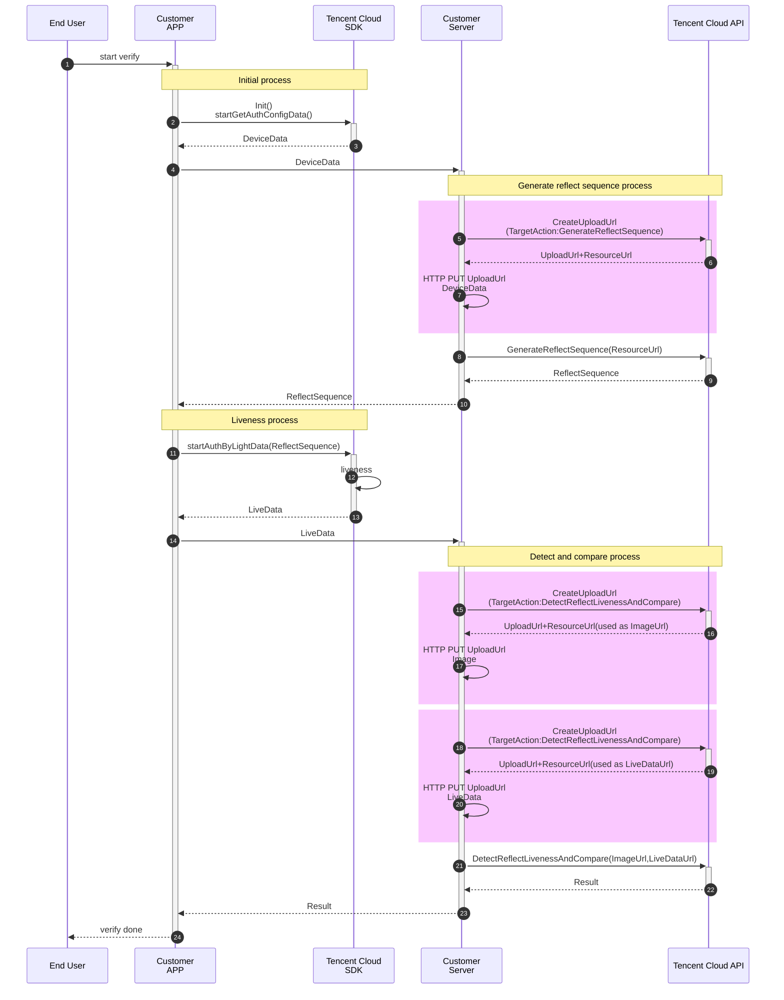

## 接入准备
- 注册腾讯云企业账号，请见[注册指引](https://www.tencentcloud.com/zh/document/product/378/17985)
- 完成企业实名认证，请见[企业实名指引](https://www.tencentcloud.com/zh/document/product/378/10496)
- 登陆慧眼控制台[开通服务](https://console.intl.cloud.tencent.com/faceid) 
- [联系我们](https://www.tencentcloud.com/zh/document/product/1061/52144)获取最新的SDK及License


## 名词介绍

- Customer APP: 客户开发的APP
- Customer Server: 客户的业务后台
- Tencent Cloud API: 腾讯云提供的后台接口，用于获取刷脸凭证并获取刷脸结果
- SDK: 腾讯云提供的Android或者iOS的SDK，用于集成入客户的APP并结合后台接口启动刷脸

## 接入时序图

实际使用时，腾讯云建议使用`CreateUploadUrl`接口来传递数据资源，即下图中颜色区域的流程。客户业务后台也可以通过其他方式上传资源，详见[如何传递资源](https://www.tencentcloud.com/zh/document/product/1061/46849) 。


相关后台接口：[GenerateReflectSequence](https://www.tencentcloud.com/zh/document/product/1061/47646)，[DetectReflectLivenessAndCompare](https://www.tencentcloud.com/zh/document/product/1061/44246)，[CreateUploadUrl](https://www.tencentcloud.com/zh/document/product/1061/47648)

## 具体接入步骤

### 1、终端：SDK 初始化与获取鉴权信息（Initial process）
在使用慧眼SDK之前，需要调用此方法传入基本配置参数，同时通过回调拉取本地的配置参数信息。

Android代码示例：

```java
// HuiYanOs的相关参数
HuiYanOsConfig huiYanOsConfig = new HuiYanOsConfig();
// 此license文件存放在assets下
huiYanOsConfig.setAuthLicense("YTFaceSDK.license");
// 启动核身前，拉取本地的配置参数信息
HuiYanOsApi.startGetAuthConfigData(huiYanOsConfig, new HuiYanConfigCallback() {
		@Override
		public void onSuccess(String result) {
			// 获取配置信息成功, 将配置信息发送给服务器，兑换启动核身配置，服务器下发的光线序列（客户自己实现上图step 4）
			String reflectSequence = getAuthLightData(result);
      // ... 剩余步骤
		}

		@Override
		public void onFail(int errorCode, String errMsg) {
			// 获取配置参数失败（客户自己实现）
			showError(errorCode, errMsg);
		}
});
```

iOS代码示例：

```objective-c
// HuiYanOs的相关参数
HuiYanOsConfig *config = [[HuiYanOsConfig alloc] init];
// license文件在bundle中的路径
config.authLicense = [[NSBundle mainBundle] pathForResource:@"YTFaceSDK.license" ofType:@""];
// 活体检测本地检测超时时间（ms）
config.authTimeOutMs = 20000;
//指定HuiYanSDKUI.bundle 内语言目录文件
config.setLanguageFileName = @"th";//th.lproj
// 启动核身前，拉取本地的配置参数信息
[HuiYanOsApi startGetAuthConfigData:config withSuccCallback:^(NSString * _Nonnull result) {
  	// 获取配置信息成功, 将配置信息发送给服务器，兑换启动核身配置，服务器下发的光线序列（客户自己实现上图step 4）
  	NSString *liveData = [self getLiveDataWith:result];
} withFialCallback:^(int errCode, NSString * _Nonnull errMsg) {
  	// 获取配置参数失败（客户自己实现）
    NSLog(@"errCode:%d, errMsg:%@", errCode, errMsg);
}];
```

SDK的`startGetAuthConfigData`方法需要传入一个回调函数，用于**接收DeviceData数据并通过客户服务端上传至腾讯云**。通过 SDK 获取的 DeviceData 的示例数据如下：

```json
{
    "platform": 2,
    "select_data": "{\"change_point_num\":2,\"android_data\":{\"build_device\":\"flame\",\"build_display\":\"TP1A.220624.014\",\"build_product\":\"flame\",\"build_brand\":\"google\",\"build_model\":\"Pixel 4\",\"android_apilevel\":\"33\",\"build_hardware\":\"flame\",\"android_version\":\"13\",\"lux\":-10000},\"client_version\":\"sdk_version:1.1.20.221.1;ftrack_sdk_version:v3.0.5-mini.12;freflect_sdk_version:3.6.9.2;faction_sdk_version:3.7.5\",\"protocal\":1,\"config\":\"need_action_video\u003dtrue\u0026sdcs\u003d00031.1.20.221.101a634e43d16fe194c41712bf91c56076dd319a0fdcfd575a49d788ec950740ae54f38f04ae\",\"version\":\"3.6.9.2\",\"platform\":2,\"reflect_param\":\" version 2\"}"
}
```

**注意：不要直接在终端调用腾讯云的接口**

### 2、 服务端：上传DeviceData并生成光线序列（Generate reflect sequence process）

#### 2.1 使用 [CreateUploadUrl](https://www.tencentcloud.com/document/product/1061/47648) 接口上传资源。
**注1：本步骤描述的是通用的上传资源方式，后续环节中涉及上传资源操作的，均可参考本步骤。**

该接口作用是获取两个地址，`UploadUrl`为上传资源的目标地址，`ResourceUrl`为访问资源的地址。

输入参数：
- TargetAction：cos 资源用于的接口名称，如：GenerateReflectSequence、DetectReflectLivenessAndCompare
- Region: 资源上传的目的地域。**重要！！！：调用TargetAction时传入的Region必须跟调用本接口时传入的Region保持一致，否则会调用失败。**

输出参数：
- UploadUrl：上传资源的目标地址，通过 HTTP 的 PUT 方式进行上传
- ResourceUrl：cos 资源地址，能够访问已上传资源的地址
- ExpiredTimestamp：访问地址与上传地址过期的时间戳
- RequestId：当前请求的 id

下面为 python 示例的 SDK 调用方式：

```py
from tencentcloud.common import credential
from tencentcloud.common.exception.tencent_cloud_sdk_exception import TencentCloudSDKException
from tencentcloud.faceid.v20180301 import faceid_client, models

# 为开通服务时申请的对应 secretId 和 secretKey ，只需修改这两个参数即可
secretId = ""
secretKey = ""

try:
    cred = credential.Credential(secretId, secretKey)
    # 注意这里对请求地域有要求，要求详见接口文档
    client = faceid_client.FaceidClient(cred, "ap-hongkong")

    req = models.CreateUploadUrlRequest()
    # 这里是输入参数
    # TargetAction: string cos 资源使用的目标接口
    req.TargetAction = "GenerateReflectSequence"
    
    resp = client.CreateUploadUrl(req)
    print(resp.to_json_string())

except TencentCloudSDKException as err:
    print(err)
```

返回内容为：

```json
{
    "UploadUrl": "https://faceid-resource-hk-1258344699.cos.ap-hongkong.myqcloud.com/faceid%2FGenerateReflectSequence%2F1300847512%2F66f265e1-6d93-489e-9b34-8e75d8f6ecd8?q-sign-algorithm=sha1&q-ak=AKIDkJcgTzFEwNXR4SZP0KNAhxwf8KFsEJ7e&q-sign-time=1676537007%3B1676544207&q-key-time=1676537007%3B1676544207&q-header-list=host&q-url-param-list=&q-signature=2ae43986ba2feb0d04dde37ac7b140d8f9596fa7",
    "ResourceUrl": "https://faceid-resource-hk-1258344699.cos.ap-hongkong.myqcloud.com/faceid%2FGenerateReflectSequence%2F1300847512%2F66f265e1-6d93-489e-9b34-8e75d8f6ecd8?q-sign-algorithm=sha1&q-ak=AKIDkJcgTzFEwNXR4SZP0KNAhxwf8KFsEJ7e&q-sign-time=1676537007%3B1676544207&q-key-time=1676537007%3B1676544207&q-header-list=host&q-url-param-list=&q-signature=9a689732863cef49671d265b39e9aba8fa8f6947",
    "ExpiredTimestamp": 1676544207,
    "RequestId": "66f265e1-6d93-489e-9b34-8e75d8f6ecd8"
}
```

然后需要将第一步中的产生的 DeviceData 整体**进行 base64** ，通过 `UploadUrl`的地址，采用 HTTP 的 PUT 的方式上传至 COS 资源。

下面为 python 示例：

```py
import requests
import base64
import json

# 这里填写接口 CreateUploadUrl 返回参数UploadUrl内容
upload_url = "https://faceid-resource-hk-1258344699.cos.ap-hongkong.myqcloud.com/faceid%2FGenerateReflectSequence%2F1300847512%2F66f265e1-6d93-489e-9b34-8e75d8f6ecd8?q-sign-algorithm=sha1&q-ak=AKIDkJcgTzFEwNXR4SZP0KNAhxwf8KFsEJ7e&q-sign-time=1676537007%3B1676544207&q-key-time=1676537007%3B1676544207&q-header-list=host&q-url-param-list=&q-signature=2ae43986ba2feb0d04dde37ac7b140d8f9596fa7"

# 这里填写第一步产生的 DeviceData
device_data = {
    "platform": 2,
    "select_data": "{\"change_point_num\":2,\"android_data\":{\"build_device\":\"flame\",\"build_display\":\"TP1A.220624.014\",\"build_product\":\"flame\",\"build_brand\":\"google\",\"build_model\":\"Pixel 4\",\"android_apilevel\":\"33\",\"build_hardware\":\"flame\",\"android_version\":\"13\",\"lux\":-10000},\"client_version\":\"sdk_version:1.1.20.221.1;ftrack_sdk_version:v3.0.5-mini.12;freflect_sdk_version:3.6.9.2;faction_sdk_version:3.7.5\",\"protocal\":1,\"config\":\"need_action_video\u003dtrue\u0026sdcs\u003d00031.1.20.221.101a634e43d16fe194c41712bf91c56076dd319a0fdcfd575a49d788ec950740ae54f38f04ae\",\"version\":\"3.6.9.2\",\"platform\":2,\"reflect_param\":\" version 2\"}"
}
device_data_str = json.dumps(device_data)
# 将数据进行 base64
device_data_bs64 = base64.b64encode(device_data_str.encode("utf-8")).decode()
res = requests.put(upload_url, device_data)
print(res.json)
```

如果返回结果成功，那么就可以通过访问 `ResourceUrl` 的地址进行查看。

#### 2.2 使用 [GenerateReflectSequence](https://www.tencentcloud.com/document/product/1061/47646) 生成光线序列。

该API用于根据活体比对（基于反光）SDK收集到的信息生成合适的光线序列，并将光线序列传入SDK，启动身份验证流程。

输入参数：
- Region：需要与上方请求 cos 资源时输入的地域保持一致
- DeviceDataUrl：CreateUploadUrl中返回的 ResourceUrl
- DeviceDataMd5：对于DeviceData 进行 base64后，再进行 MD5 加密的结果
- SecurityLevel：安全级别，非必填参数

输出参数：

- ReflectSequenceUrl：光线序列的资源URL，需要下载并传递给SDK启动身份验证流程
- ReflectSequenceMd5：光线序列的 MD5 值，用于校验光线序列一致性
- RequestId：当前请求的 id

下面为 python 示例的 SDK 调用方式：

```python
from tencentcloud.common import credential
from tencentcloud.common.exception.tencent_cloud_sdk_exception import TencentCloudSDKException
from tencentcloud.faceid.v20180301 import faceid_client, models

# 为开通服务时申请的对应 id 和 key，只需修改这两个参数即可
secretId = ""
secretKey = ""

try:
    cred = credential.Credential(secretId, secretKey)

    client = faceid_client.FaceidClient(cred, "ap-hongkong")

    req = models.GenerateReflectSequenceRequest()
    # 这里为输入参数
    # DeviceDataUrl : string 上传 COS 资源的ResourceUrl
    # DeviceDataMd5 : string DeviceData 进行 base64后，再进行 MD5 加密的结果
    req.DeviceDataUrl = "https://faceid-resource-hk-1258344699.cos.ap-hongkong.myqcloud.com/faceid%2FGenerateReflectSequence%2F1300847512%2F66f265e1-6d93-489e-9b34-8e75d8f6ecd8?q-sign-algorithm=sha1&q-ak=AKIDkJcgTzFEwNXR4SZP0KNAhxwf8KFsEJ7e&q-sign-time=1676537007%3B1676544207&q-key-time=1676537007%3B1676544207&q-header-list=host&q-url-param-list=&q-signature=9a689732863cef49671d265b39e9aba8fa8f6947"
    req.DeviceDataMd5 = "809fc43098132b4a67871c809b807ecc"
    resp = client.GenerateReflectSequence(req)
    print(resp.to_json_string())

except TencentCloudSDKException as err:
    print(err)
```

返回结果为：

```json
{
    "ReflectSequenceUrl": "https://faceid-resource-hk-1258344699.cos.ap-hongkong.myqcloud.com/faceid-tmp%2FGenerateReflectSequence%2F75cd2553-32a9-4589-930e-aac5bbbee391_LightData?q-sign-algorithm=sha1&q-ak=AKIDkJcgTzFEwNXR4SZP0KNAhxwf8KFsEJ7e&q-sign-time=1676539577%3B1676546777&q-key-time=1676539577%3B1676546777&q-header-list=host&q-url-param-list=&q-signature=9c5fead3fc49037d522612fb410f37c3b46ee43c",
    "ReflectSequenceMd5": "f5fd2871de13801fa0254d1305babab5",
    "RequestId": "75cd2553-32a9-4589-930e-aac5bbbee391"
}
```
获取到`ReflectSequenceUrl`后，客户服务端需要下载该文件，校验改文件的md5值，最后返回给终端进行下一个步骤。

### 3、终端：通过光线序列调用相机获取活体数据（Liveness process）
当您已经将配置信息从服务器端兑换完成之后，将服务器下发的reflectSequence也就是核身的光线序列，通过此接口传入继续完成剩余本地核身功能。

Android代码示例：
```java
// 启动核验，reflectSequence为上一步从服务器端兑换的光线序列的数据
HuiYanOsApi.startAuthByLightData(reflectSequence, new HuiYanResultCallBack() {
		@Override
		public void onSuccess(byte[] data, String videoPath) {
			// 1. 将本地核身的数据信息，发送到服务器端做比对验证，得到最终结果。（客户自己实现上图step 10）
			checkAuthResultByData(data);
			// 2. 处理本地核身视频videoPath。（客户自己实现）
			dealWithAuthVideo(videoPath);
		}

		@Override
		public void onFail(int errorCode, String errMsg) {
			// 本地核身失败获取，发生错误
			showError(errorCode, errMsg);
		}
});
```

iOS代码示例：
```objective-c
[HuiYanOsApi startAuthByLightData:liveData withSuccCallback:^(NSData * _Nonnull data, NSString * _Nonnull videoPath) {
     	//活体通过检测结果数据
  		// 1. 将本地核身的数据信息，发送到服务器端做比对验证，得到最终结果。（客户自己实现上图step 10）
		 	[self checkAuthResultByData:data];
			// 2. 处理本地核身视频videoPath。（客户自己实现）
			[self dealWithAuthVideo:videoPath];
} withFialCallback:^(int errCode, NSString * _Nonnull errMsg) {
  		// 本地核身失败获取，发生错误
      NSLog(@"errCode:%d, errMsg:%@", errCode, errMsg);
}];
```

SDK的`startAuthByLightData`方法需要传入一个回调函数，用于**接收LiveData（活体数据）并通过客户服务端上传至腾讯云**。

### 4、服务端 ：调用 DetectReflectLivenessAndCompare接口（Detect and compare process）

#### 4.1 使用 [CreateUploadUrl](https://www.tencentcloud.com/document/product/1061/47648) 上传资源，并获取对应的UploadUrl和ResourceUrl。
参考2.1，上传**LiveData（活体数据）**与**要比对的图片**，

#### 4.2 使用 [DetectReflectLivenessAndCompare](https://www.tencentcloud.com/zh/document/product/1061/44246) 接口进行活体与比对。

本接口用于通过活体比对（基于反光）SDK生成的包进行活体检测，并将检测到的人与传入的图片中的人进行比对。

输入参数：

- LiveDataUrl：活体数据的 url。时序图中第13步产生的活体数据，**压缩为 gz 格式**的压缩包后，按照2.1上传资源指引上传 cos
- LiveDataMd5：活体数据的 MD5
- ImageUrl：要比对的图片的 url
- ImageMd5：要比对图片的 MD5

输出参数：

- Result：服务端结果码
- Description：服务端结果说明
- BestFrameUrl：最佳帧 URL 地址，存储有效期为 2 小时
- BestFrameMd5：最佳帧的 MD5 值，用于校验最佳帧文件的一致性
- Sim：相似度，取值范围：[0.00, 100.00]，表示当前输入参数的图片中人脸照片，与活体阶段的最佳帧中人脸照片的相似度
- RequestId：当前请求的 id

下面为 python 示例的 SDK 调用方式：

```python
from tencentcloud.common import credential
from tencentcloud.common.exception.tencent_cloud_sdk_exception import TencentCloudSDKException
from tencentcloud.faceid.v20180301 import faceid_client, models

# 为开通服务时申请的对应 id 和 key，只需修改这两个参数即可
secretId = ""
secretKey = ""

try:
    cred = credential.Credential(secretId, secretKey)
    client = faceid_client.FaceidClient(cred, "ap-hongkong")

    req = models.DetectReflectLivenessAndCompareRequest()
    # 这里为输入参数
    req.LiveDataUrl = "https://faceid-resource-sg-1254418846.cos.ap-singapore.myqcloud.com/faceid%2FApplyWebVerificationToken%2F1300268875%2F20b11b59-572d-406d-8d94-e6e05782134c"
    req.LiveDataMd5 = "d41d8cd98f00b204e9800998ecf8427e"
    req.ImageUrl = "https://faceid-resource-sg-1254418846.cos.ap-singapore.myqcloud.com/faceid%2FApplyWebVerificationToken%2F1300268875%2F20b11b59-572d-406d-8d94-e6e05782134c"
    req.ImageMd5 = "d41d8cd98f00b204e9800998ecf8427e"
    resp = client.DetectReflectLivenessAndCompare(req)
    print(resp.to_json_string())

except TencentCloudSDKException as err:
    print(err)
```

返回结果为：

```json
{
    "BestFrameUrl": "https://faceid-resource-sg-1254418846.cos.ap-singapore.myqcloud.com/faceid%2FApplyWebVerificationToken%2F1300268875%2F20b11b59-572d-406d-8d94-e6e05782134c",
    "Description": "Success",
    "BestFrameMd5": "d41d8cd98f00b204e9800998ecf8427e",
    "RequestId": "00577fa0-9d11-459e-a455-fc202ecd65bc",
    "Sim": 96.3,
    "Result": "Success"
}
```

## 排障指引
腾讯云不会存储客户服务侧上传的资源，需要客户服务端侧保留**所有的资源**与**API3.0回包中的RequestId**方可定位问题。其中**资源**包括：
- 生成光线序列阶段上传的`DeviceData`
- 调用 DetectReflectLivenessAndCompare接口阶段上传的`Image`
- 调用 DetectReflectLivenessAndCompare接口阶段上传的`LiveData`

API3.0回包中的RequestId指的都是`Response.RequestId`字段，包括接口有：
- CreateUploadUrl
- GenerateReflectSequence
- DetectReflectLivenessAndCompare
